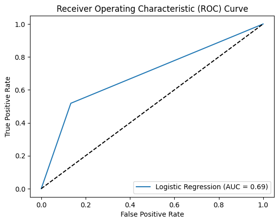
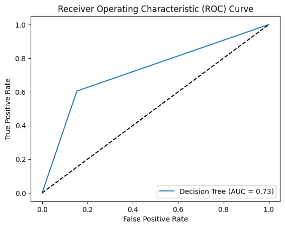

## ROC curve for logistical regression and decision tree

#Table evaluation of logistical regression and decision tree
id | Model | Accuracy | Precision | Recall | F1-score | AUC

0 Logistic Regression 0.744589 0.677419 0.518519 0.587413 0.692593
1 Decision Tree 0.761905 0.680556 0.604938 0.640523 0.725802

#Short Discussion of results :
The decision tree model performed better than the logistic regression model as per ROC and Recall . The dataset has presence of outliers in Insulin , DiabetesPedigreeFunction and Age. The dataset is also small with only 768 samples.

The dataset is also not very clean with missing values and outliers. The dataset is also not very diverse with only 500 samples for class 0 and 268 samples for class 1. The dataset is also not very balanced with 500 samples for class 0 and 268 samples for class 1

Some features have high correlation with each other. For example, Insulin and Glucose have a correlation of 0.49. This can lead to multicollinearity in the model.

For medical professional, Decision tree model can be used to predict the likelihood of a patient having diabetes as it has better recall and ROC than logistic regression. Also, it models the real world decision making process of a doctor.

Logistical regression can be used to understand the impact of each feature on the likelihood of a patient having diabetes.
